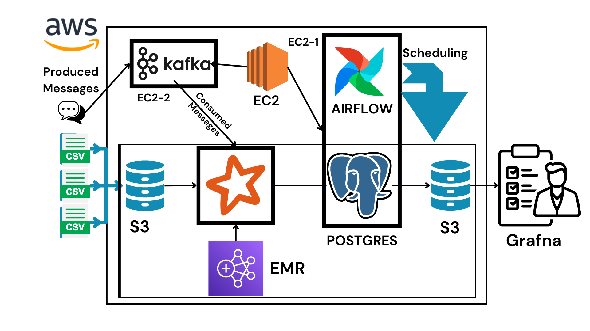

# Business Requirement Document (BRD)

## Business Needs
The following business needs must be fulfilled:
- **Tracking Employee Leave History and Quotas:** Maintain records of leave history and quotas for each employee.
- **Identifying Employees with Excessive Leave Requests:** Detect patterns of excessive leave requests among employees.
- **Monitoring Employee Communications for Misuse:** Ensure employee communications are monitored for potential misuse.
- **Efficient Management of Employee Data:** Streamline the management of employee-related data.

## Data Sources
1. **employee_data.csv**
   - **Description:** Contains employee data, including employee ID, age, and name. The data clarity is high.
   - **Location:** `S3://{bucket-name}/{emp-data}/`
   - **Frequency:** Daily at 00:00 UTC

2. **employee_timeframe_data.csv, employee_timeframe_data_1.csv**
   - **Description:** Provide information about an employee's tenure at a particular designation with a specific salary. The start_date and end_date are given as Unix timestamps.
   - **Location:** `S3://{bucket-name}/{emp-time-data}/`
   - **Frequency:** Daily at 00:00 UTC

3. **employee_leave_quota_data.csv**
   - **Description:** Represents the leave quota allocated to every employee annually.
   - **Location:** `S3://{bucket-name}/leave-quota/`
   - **Frequency:** Yearly

4. **employee_leave_calendar_data.csv**
   - **Description:** Represents the mandatory holidays for the year. These leaves are in addition to the allocated leave quota for employees.
   - **Location:** `S3://{bucket-name}/leave-calendar/`
   - **Frequency:** Yearly on January 1st

5. **employee_leave_data.csv**
   - **Description:** Represents the actual leaves applied for or taken by employees.
   - **Location:** `S3://{bucket-name}/leave-data/`
   - **Frequency:** Daily at 07:00 UTC

6. **vocab.json**
   - **Description:** Contains all words used in the messages sent by employees.
   - **Location:** `S3://{bucket-name}/vocab/`
   - **Frequency:** As needed

7. **marked_word.json**
   - **Description:** Contains reserved words that are flagged in messages.
   - **Location:** `S3://{bucket-name}/marked-words/`
   - **Frequency:** As needed

8. **message.json**
   - **Description:** Contains sample messages that will be coming through Kafka servers.
   - **Location:** `S3://{bucket-name}/messages/`
   - **Frequency:** Real-time streaming via Kafka Confluent

## Data Processing Details

### Task 1
**Append-Only Incremental Table from Employee Data**
- **Input Data:** `employee_data.csv` from S3 bucket-Bronze

### Task 2
**Incremental Table from Employee Time Data**
- **Input Data:** `employee_timeframe_data.csv` and `employee_timeframe_data_1.csv` from S3 bucket-Bronze

### Task 3
**Append-Only Yearly Incremental Table for Leave Quota**
- **Input Data:** `employee_leave_quota_data.csv` from S3 bucket-Bronze

**Append-Only Yearly Incremental Table for Leave Calendar**
- **Input Data:** `employee_leave_calendar_data.csv` from S3 bucket-Bronze

**Daily Update Table for Leaves Taken or Applied**
- **Input Data:** `employee_leave_data.csv` from S3 bucket-Bronze

### Task 4
**Active Employee by Designation Report**
- **Input Data:** `employee_timeframe_data.csv` from S3 bucket-Silver

**Employees with Potential Excessive Leaves**
- **Input Data:** `employee_leave_data.csv`, `employee_leave_calendar_data.csv` from S3 bucket-Silver

**Percentage of Leave Quota Used and Alert Generation**
- **Input Data:** `employee_leave_data.csv`, `employee_leave_quota_data.csv` from S3 bucket-Silver

### Task 5
**Streaming System for Flagging Messages and Salary Deduction**
- **Input Data:** Kafka stream with messages

# System Architecture

This workflow involves the following steps for processing and handling data efficiently:

## Data Ingestion to S3
- **Data Sources**: 
  - Data arrives in the S3 bucket either as daily incremental/appending data or yearly appending data.

## Data Processing Using Apache Spark on Amazon EMR
- **Processing Steps**: 
  - The data stored in S3 is processed using Apache Spark with steps executed on Amazon EMR.

## Message Handling with Apache Kafka
- **Kafka Setup**:
  - Producers send messages to a Kafka topic.
  - A Kafka topic is a category or feed name to which records are sent. Kafka runs as a cluster of one or more servers, known as brokers, which manage the storage and retrieval of records. Each broker handles a part of the topic's partitions.
- **Role of Kafka**:
  - Kafka acts as a broker to handle the high throughput of data. It stores and forwards these messages to consumers from Kafka topics.

## Kafka Message Processing with Apache Spark on Amazon EMR
- **Processing Messages**:
  - The messages from Kafka topics are processed using Apache Spark with steps executed on Amazon EMR.

## Data Loading into PostgreSQL
- **Loading Transformed Data**:
  - After processing, the transformed data is loaded into a PostgreSQL database.

## Data Backup and Visualization
- **Data Backup**:
  - The data from PostgreSQL is exported back to S3 for backup purposes.
- **Data Visualization**:
  - PostgreSQL is connected to Grafana for data visualization.

This system architecture ensures efficient data processing, storage, and visualization by leveraging the capabilities of **S3**, **Apache Kafka**, **Apache Spark**, **Amazon EMR**, **PostgreSQL**, and **Grafana**.

